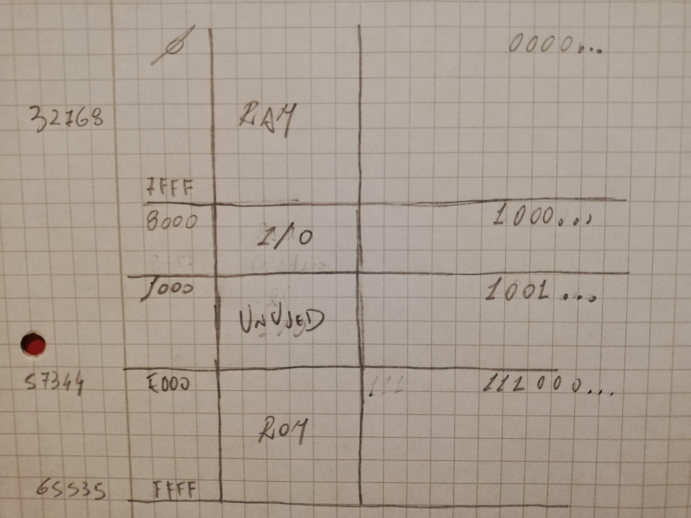
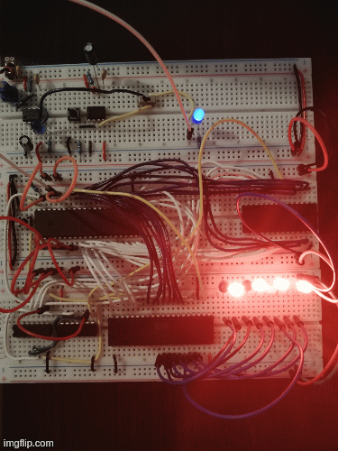

Resourses for an 8 bit computer based on the 6502 microprocessor


### Components
_Micro processor and memory_
- [W65C02S Microprocessor](./datasheets/w65c02s-micro-processor.pdf)
- [AT28C64B 64K (8K x 8) ParallelEEPROM](./datasheets/28C64-eeprom.pdf)

_Peripherals_
- [W65C22S Interface Adapter](./datasheets/W65C22S6TPG-14-interface-adapter.pdf)

_Address decoding logic_
- [74HCT14 hex inverter](./datasheets/74HC_HCT14-inverter.pdf)
- [HD74HC11P triple input AND gate](./datasheets/HD74HC11P-triple-input-and-gate.pdf)

_Clock Module (for debugging)_  
The module is used for debugging, genereting a slow clock pulse or allowing to execute one instruction at the time
- [555 timer](./datasheets/lm555-timer.pdf)
- 0.1 and 1 Microfarad capacitors
- 1K and 10K resistors
- 1M variable resistor
- Push buttons, switch and leds

_Clock Module_
- [1 MHz oscillator](./datasheets/1MHz-oscillator-AEL9700CS.pdf)

### Memory mapping



### Hello world
The 8 bit computer running a simple program which turns on eight leds, first the ones in a even position and then the ones in a odd position, looping forever.

Run:
```
python blink-leds.py
```

which generates the image for the ROM in the file `program.bin`.  
Then connect the eeprom to the programmer and run:

```
minipro -p AT28C64B -w program.bin
```




---------------------
## WIP

### Build assemly file with the cc65 compiler suite

#### Install cc65

```
git clone https://github.com/cc65/cc65.git
cd cc65
make
```
Move the generated binaries somewhere under $PATH.


#### Build blink.s

```
cl65 -C load.cfg --cpu 65C02 --no-target-lib blink.s
```

which builds the `blink` binary.


__Note__  
This binary should be exactly the same as the one generated by the python program

```
python blink-leds.py
cl65 -C load.cfg --cpu 65C02 --no-target-lib blink.s
```

compare with:
```
diff <(xxd ./blink) <(xxd ./program.bin)
```
which should return nothing (meaning the binary are the same).

#### Upload to mini pro

```bash
minipro -p AT28C64B -w blink
```


#### Links
- https://github.com/caseywdunn/eater_6502?tab=readme-ov-file
- https://www.grappendorf.net/projects/6502-home-computer/software-development.html
- https://www.masswerk.at/6502/6502_instruction_set.html#STA
- https://github.com/peternoyes/dodo-sim
- https://mike42.me/blog/2021-07-adding-a-serial-port-to-my-6502-computer
- utils in asm and C for cc65 - https://github.com/tisnik/8bit-fame/tree/master/cc65
- https://github.com/SleepingInsomniac/6502-Breadboard-Computer
- https://cc65.github.io/doc/intro.html
- https://forums.atariage.com/topic/296494-calling-asm-proc-from-c/
- https://github.com/dbuchwald/6502/blob/master/Software/rom/04_blink_s/blink.s
- https://github.com/sethm/symon
- https://stackoverflow.com/questions/10595467/org-assembly-directive-and-location-counter-in-linker-script
- https://cc65.github.io/doc/
- https://www.tejotron.com/
- https://www.reddit.com/r/beneater/comments/evis0o/6502_and_c_language/


Push registers to stack: https://youtu.be/xBjQVxVxOxc?si=bFp7z4tenfyvrqtS&t=1049


Install minipro
```
sudo apt-get install build-essential pkg-config git libusb-1.0-0-dev fakeroot debhelper dpkg-dev
git clone https://gitlab.com/DavidGriffith/minipro.git
cd minipro
make
sudo make install


sudo usermod -a -G plugdev YOUR-USER
```

attach the programmer to the laptop. Run the minipro --version, you should minipro recognizing the device:
```
 pactvm > minipro --version
Supported programmers: TL866A/CS, TL866II+,T48 (experimental)
Found TL866II+ 04.2.132 (0x284)
Device code: 02092661
Serial code: 5BJVT6MR20ZZJBB0JPAE
minipro version 0.6     A free and open TL866 series programmer
Commit date:    2024-02-11 20:34:27 -0800
Git commit:     77c26fd2e5d8674d65382a3eff4628013483c4d2
Git branch:     master
TL866A/CS:      14184 devices, 44 custom
TL866II+:       16281 devices, 45 custom
Logic:            283 devices, 4 custom
```


### Disassemble
```
da65 --cpu 65C02 -g --comments 4 blink_subroutines | less

```

### Incremental levels of abstractions
Before we start. 6502 reads from `0x1ffc` (low byte) and `0x1ffd` (high byte) the address where to read the first instruction. We need to write at that address where that is. In this project, the first instruction is
at location 0 in the ROM, which is 0xE000 (1110000000000000) as seen by the CPU (see memory mapping)

- `blink-leds.py` creates the binary by specifing the 6502 instructions in binary. No assembler.
The program does not RAM. It blinks without a wait, so run it with a slow clock. The python script creates
a binary that exactly fits the rom and sets the address `0x1ffc` and `0x1ffd` to 0xE000
- `blink.s` it's the assembly version of the previous program. 
- `ram_test.s` is the first program that needs a ram to be installed. It verfies the ram works by storing something in ram and reading it back
- `blink_subroutines.s` runs the blink program with subroutines. This requires a ram since the `RTS` function (return sub routine) needs to know where to return to. This info is stored in the stack by the `JSR` (jump sub routine). The assemply also use `PHX` and `PLX` (push/pull x register to stack) to showcase how a subroutine can avoid interfere with registers being set outside of the subroutine.


### How do hardware timer/time sleep works
https://www.youtube.com/watch?v=g_koa00MBLg&ab_channel=BenEater


### Compiling C
```
cp ~/github/cc65/lib/supervision.lib ~/github/8-bit-computer/leds_in_c/

ca65 --cpu 65C02 io.s

ca65 --cpu 65C02 crt0.s
ar65 a supervision.lib crt0.o
cc65 -t none --cpu 65C02 main.c
ca65 --cpu 65C02 main.s
ld65 -C load.cfg -o kernel.bin -vm crt0.o io.o main.o supervision.lib
minipro -p AT28C64B -w kernel.bin
```
